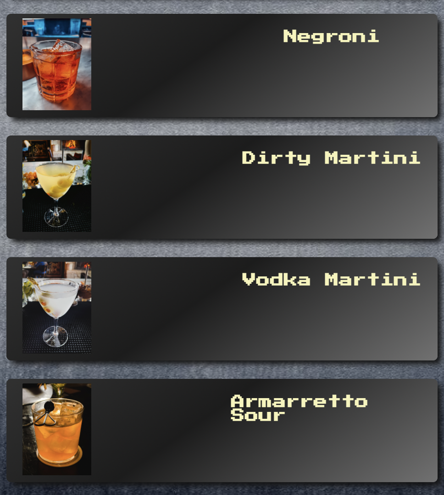
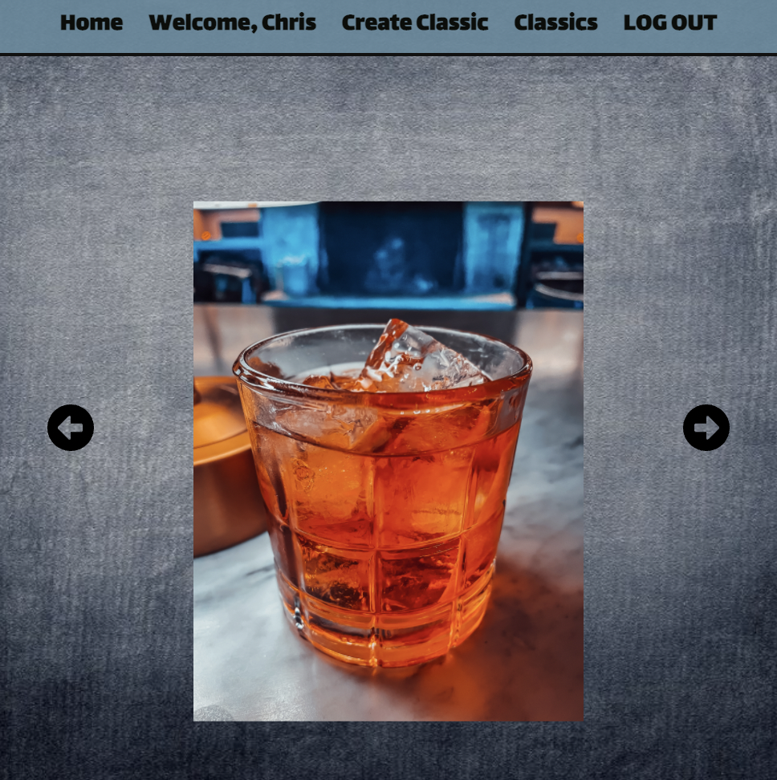

# Classics
A place to create and view classics of every category

## [Link To The App Here](https://theclassics.netlify.app/classics "Cocktail Foundations")

## About:
This app uses python and flask for a backend server and react for a frontend server. 

## How To Use:
1. Register/Login to an account
2. View, Edit, Delete your classics

## Technologies Used:

                   
## Future Enhancements:

1. Style Improvements
2. Picture Upload in create classic
3. Logo add

